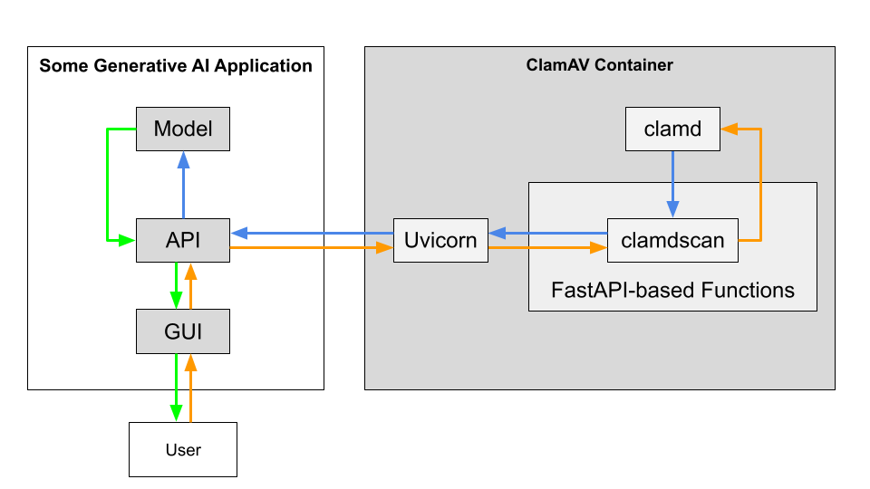

# Docker ClamAV
Docker ClamAV is a containerized version of the ClamAV daemon. It's designed to be a "drop-in" solution for situations where you need a container that can scan a file (sent via HTTP and return a string to indicate whether the file is malicious or benign. 

## Usage
Below are two examples of how to start Docker ClamAV and send files to it. Docker ClamAV will return one of the following strings: `malicious`, `benign`, or `error`. If you get `error` in response, this is related to the clamd daemon itself (not clamdscan, the FastAPI-based functions, or Uvicorn). 

### Example 1
This example example sends the `EICAR.txt` file, a well-known method of verify an anti-virus program is working. 

**Step 1.** Build and start the Docker ClamAV container.
```bash
docker compose -f compose.yml up --build
```

**Step 2.** Send a file to the `api/v1/scan` endpoint using a HTTP POST request.
```bash
curl -X POST http://localhost:8000/api/v1/scan -F "file=@tests/EICAR.txt"
```

On the client side, you should get output similar to below.
```
"malicious"
```

On the server side, you should get logs similar to below.
```
clamav  | INFO:     172.29.0.1:54694 - "POST /api/v1/scan HTTP/1.1" 200 OK
clamav  | Tue Jun 25 17:52:25 2024 -> /tmp/EICAR.txt: Win.Test.EICAR_HDB-1 FOUND
```

### Example 2
This example sends Mimikatz, a well-known credential dumper that should trigger nearly any anti-virus programs (e.g., Windows Defender and ClamAV). 

**Step 1.** Download Mimikatz using the provided script.
```bash
bash tests/get-mimikatz.sh
```

**Step 2.** Build and start the Docker ClamAV container.
```bash
docker compose -f compose.yml up --build
```

**Step 3.** Send Mimikatz to the `api/v1/scan` endpoint using a HTTP POST request.
```bash
curl -X POST http://localhost:8000/api/v1/scan -F "file=@tests/mimikatz.exe"
```

On the client side, you should get output similar to below.
```
"malicious"
```

On the server side, you should get logs similar to below.
```
clamav  | INFO:     172.29.0.1:39248 - "POST /api/v1/scan HTTP/1.1" 200 OK
clamav  | Tue Jun 25 17:53:15 2024 -> /tmp/mimikatz.exe: Win.Dropper.Mimikatz-9778171-1 FOUND
```

## How does it work?
Docker ClamAV is a system of four components: Uvicorn, FastAPI, clamdscan, and clamd. 

**Uvicorn**  
Uvicorn is an Asynchronous Server Gateway Interface (ASGI) server used to listen for HTTP requests. It's the first process in memory you touch when interacting with Docker ClamAV. 

**FastAPI**  
FastAPI is a Python framework for building ASGI applications. The code served by Docker ClamAV's instance of Uvicorn is an ASGI application (defined in [`docker/api.py`](/docker/api.py)) written using FastAPI. 

**clamdscan**  
clamdscan is a Command Line Interface (CLI) program that can send and receive data with clamd using the clamd protocol. The ASGI application mentioned above invokes clamdscan whenever a HTTP POST request is sent to the `/api/v1/scan` endpoint. 

**clamd**  
clamd is the daemonized version of ClamAV. Docker ClamAV's instance of clamd is configured to use a local socket (i.e., `/var/run/clamav/clamd.sock`) to listen for scan requests. The decision to run clamd using a local socket instead of a TCP socket was to mitigate the risk of information disclosure and denial-of-service attacks. More information can be found on [ClamAV's blog](https://blog.clamav.net/2016/06/regarding-use-of-clamav-daemons-tcp.html). 



## Virus Definitions
Docker ClamAV is configured to download the latest virus definitions during build time and store them in the `/var/lib/clamav/` directory.

## Copyright
This project is licensed under the terms of the [MIT license](/LICENSE).
